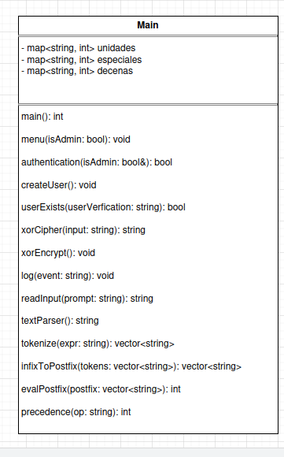
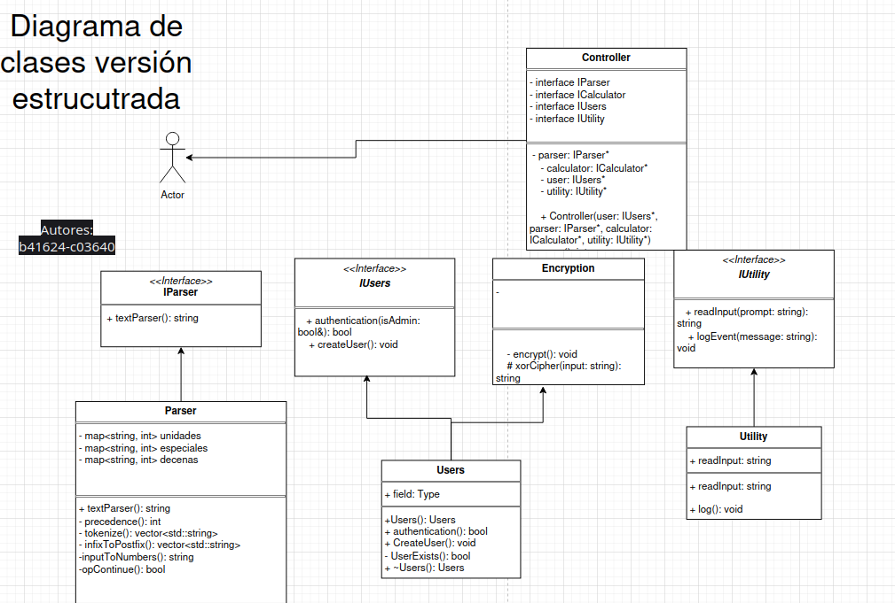
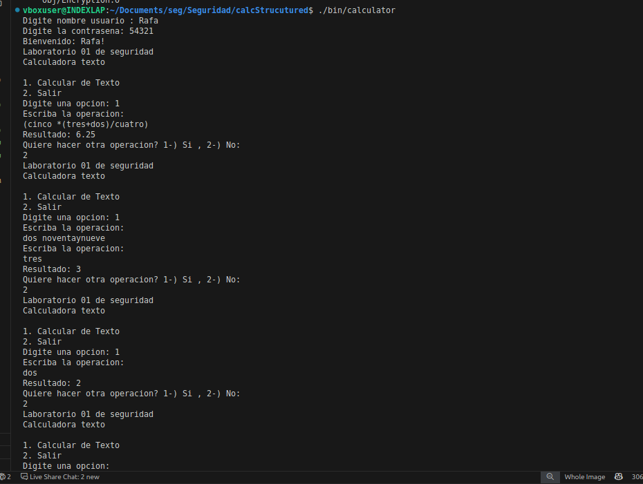
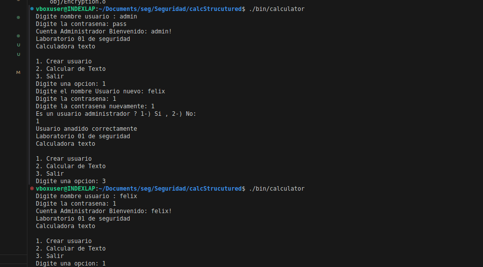

# Calculadora con operandos en texto (Borrador 1)

###
<h4 style="text-align:center;">Universidad de CostaRica</h4>
<h4 style="text-align:center;">Seguridad de Sistemas Computacionales</h4>
<h4 style="text-align:center;">CI0143 - I Semestre 2025</h4>
<h4 style="text-align:center;">Steven Castro Oreamuno</h4>
<h4 style="text-align:center;">Rafa Isaac Gutiérrez Ramírez C03640</h4>
<h4 style="text-align:center;">I-2025</h4>

---

## Indice 
1. [Descripcion](#-descripcion)
2. [Uso](#-uso)
3. [Descarga](#-descarga)
4. [Arquitectura](#-arquitectura)
    - [Version Plana](#-version-plana)
    - [Version Estructurada](#-version-estructurada)
5. [Comparacion Estruura;](#-comparacion-estructural)
6. [Pruebas](#-pruebas)

## Descripcion

    Programa de calculadora en base a texto:
- Acepta numeros del 0 al 99 en forma de texto y operandos basicos y parentesis:
- (, +, *, /, -)
- Realiza las operaciones aritmeticas
- Requiere la autenticacion del usuario
- Da autorizacion a los administradores de crear usuarios

### Objetivos de seguridad :

    Los siguientes objetivos de seguridad fueron los que se buscaba cumplir con la realizacion de esta tarea:
- Autenticacion de usuarios
- Autorizacion de usuarios de mayor nivel (administradores)
- Integridad de los operandos y los resultados
- Confidencialidad de los credenciales(archivo texto)
- Bitacora de actividades

---

## Uso

### Descarga

Se puede obtener ambas versiones mediante la clonacion del repositorio con el siguiente comando en la terminal:
```
   git clone https://github.com/StevenCastroUCR/Seguridad.git
```

### Compilacion

Usando la terminal desde la ubicacion del archivo fuente [*/calcv0* para la version plana y */calcStrucutured* para la version estructurada]laccorre el comando
```
     make
```

Una vez compilado se debe correr con el comando
```
    ./bin/calculator
```

## Arquitectura 

### Version Plana
- El programa y sus funciones se ubican en la clase main.cc
- Funciones: 
- void menu(bool isAdmin);
- string textParser();
- int precedence(const std::string &op);
- int evalPostfix(const std::vector<std::string> &postfix);
- std::vector<std::string> infixToPostfix(const std::vector<std::string> &tokens);
- std::vector<std::string> tokenize(const std::string &expr);
- bool authentication(bool &isAdmin);
- string readInput(const string &prompt);
- void createUser();
- bool userExists(const string &userVerfication);
- string xorCipher(const string &input);
- void log(const string &event);

### Version estructurada
- **Modelo:** Clase Parser y User manejan la logica de calculadora y de usuarios
- **Vista:** El usuario introduce sus consultas y es dirigido mediante menus y opciones
- **Controlador:** La clase Controller maneja el flujo de la ejecucion

#### Clases
- **Parser:** 
* int precedence(const std::string &op);
    Funcion encargada de ver el orden de precedencia
* std::vector<std::string> tokenize(const std::string &expr);
    Funcion que convierte en tokens la entrada del usuario para leerlos por separado
* std::vector<std::string> infixToPostfix(const std::vector<std::string> &tokens);
    Funcion que convierte la notacion infija a posfija
* string inputToNumbers(const string& inputToCheck);
    Funcion que convierte las entradas de letras en numeros
* double evalPostfix(const std::vector<std::string>& postfix);
    Funcion que calcula el resultado desde la notacion posfija
* bool opContinue();
    Funcion que le pregunta al usuario si desesa continuar
- **User:** 
* bool authentication(bool &isAdmin);
    Funcion encargada de autenticar a los usuraios desde un documento de texto
* void createUser();
    Funcion encargada de crear un usuario
* bool userExists(const std::string &userVerfication);
    Funcion que verifica si el usuario existe
- **Encryption:**
* void encrypt();
    Funcion que encripta valores usando el cifrado XOR
* string xorCipher(const string &input);
    Funcion de cifrado XOR
- **Controller:**
* int run();
    Funcion encargada de la ejecucion del programa
* void Menu(bool isAdmin);
    Funcion que despliega menu de opciones a los usuarios
- **Utility:**
* string readInput(const string &prompt);
    Funcion de lectura de entradas de los usuarios
* void log(const string &event);
    Funcion de bitacora que guarda los eventos exitos y de error de los usuarios 

## Comparacion de Versiones segun Seguridad Estructural

<table>
  <thead>
    <tr>
      <th>Categoria</th>
      <th>Version 1<br><em>Plana</em></th>
      <th>Version 2<br><em>Estructurada</em></th>
    </tr>
  </thead>
  <tbody>
    <tr>
      <td><strong>Organizacion de Codigo</strong></td>
      <td>Logica en un solo lugar<code>main.cpp</code></td>
      <td>Division por Modelos, Vistas, Controladores, Interfaces y Utilidades</td>
    </tr>
    <tr>
      <td><strong>Complejidad</strong></td>
      <td>Alta - Responsabilidades revueltas</td>
      <td>Reducidas - Responsabilidades separadas por Rol</td>
    </tr>
    <tr>
      <td><strong>Puntos de acceso de seguridad</strong></td>
      <td>Mezclados con una logica general</td>
      <td>Aislados en casos dedicados (<code>User</code>, <code>Parser</code>, <code>Controller</code>)</td>
    </tr>
    <tr>
      <td><strong>Encapsulacion</strong></td>
      <td>Ninguna - Todos los datos y logica estan expuestos</td>
      <td>Fuerte - Miembros de las clases encapsulan la logica y datos sensibles</td>
    </tr>
    <tr>
      <td><strong>Validacion</strong></td>
      <td>Minima - en linea</td>
      <td>Centralizada por classes, reforzada antes de la ejecucion del codigo</td>
    </tr>
    <tr>
      <td><strong>Reutilizacion de Codigo</strong></td>
      <td>Baja - Funciones repetidas</td>
      <td>High - clases y funciones de asistencia permiten la reutilizacion </td>
    </tr>
    <tr>
      <td><strong>Mantenibilidad</strong></td>
      <td>Dificil - Cambios pequeños rompen el flujo completo</td>
      <td>Mas sencilla(necesita trabajo) - Los componentes son modulares y se pueden probar</td>
    </tr>
    <tr>
      <td><strong>Manejo de credenciales</strong></td>
      <td>Inseguro - riesgo de exposicion</td>
      <td>Seguro (exposicion en la entrada requiere trabajo) - manejados en la clase <code>User</code></td>
    </tr>
    <tr>
      <td><strong>Integridad de los datos</strong></td>
      <td>Debil - poco estructuracion de resultados y validaciones</td>
      <td>Mas fuerte (requiere trabajo) - parser valida entradas</td>
    </tr>
  </tbody>
</table>

### Diagrama de Clases version Plana
  

### Diagrama de clases version Estructurada
  

# Imagenes de prueba Plana
  
Crea usuario admin.


  
Hace calculo.
# Imagenes de prueba Estructurado
 
Crea nuevo usuario 


  
Realiza calculo
